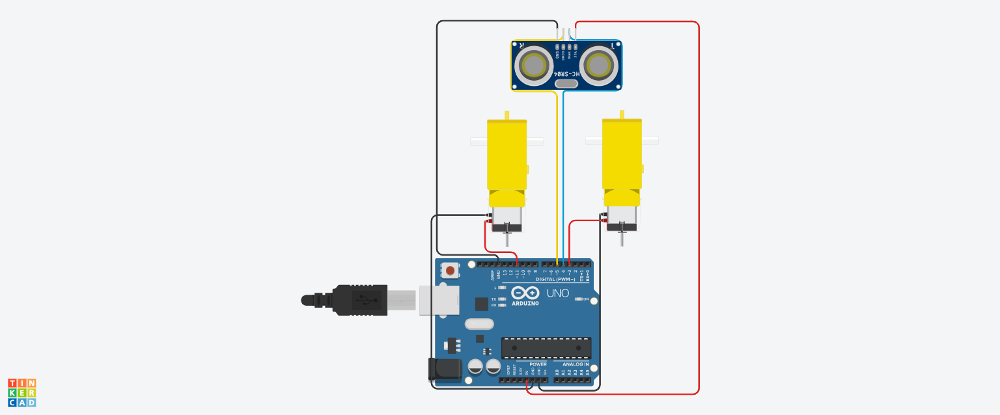

# 🚀 Hobby Gear Motor Control System  

The **Hobby Gear Motor Control System** is an innovative Arduino project that dynamically adjusts motor speed based on real-time distance measurements. Utilizing an ultrasonic sensor, this system provides intelligent motor control, perfect for robotics and automation projects.

## 📸 Circuit Diagram  
Here's the circuit setup for this project:  



## 🔧 Features  
✅ **Intelligent Distance Measurement**: Utilizes ultrasonic technology for precise distance readings.  
✅ **Dynamic Speed Control**: Automatically adjusts motor speed based on proximity, ensuring optimal performance.  
✅ **User-Friendly**: Simple setup and operation, ideal for beginners and hobbyists.  

## 🛠 Components Used  
- **Arduino Board** (e.g., Arduino Uno)  
- **Hobby Gear Motor**  
- **Ultrasonic Sensor** (HC-SR04)  
- **Jumper Wires**  
- **Breadboard** (optional for prototyping)  

## 🚀 How It Works  
1. **Connect the Circuit**: Follow the circuit diagram above for connections.  
2. **Upload the Code**: Load the provided code (`hobby_motor_control.ino`) to your Arduino.  
3. **Power On**: Observe the motor responding intelligently to distance measurements in real-time.  

## 📜 Code  
```cpp
#define mt_1 3
#define mt_2 11
#define echo 5
#define trig 4
#define V 0.034

#define max_speed 255
#define med_speed 128
#define spec_speed1 86
#define spec_speed2 44
#define spec_speed3 2
#define stop 0
#define time 1000

int impulseTime;
float S;
int analog1;

void setup()
{
  Serial.begin(9600);
  pinMode(mt_1, OUTPUT);
  pinMode(mt_2, OUTPUT);
  pinMode(trig, OUTPUT);
  pinMode(echo, INPUT);
}

void loop()
{
  digitalWrite(trig, 1);
  delayMicroseconds(10);
  digitalWrite(trig, 0);
  
  impulseTime = pulseIn(echo, 1);
  S = (V * impulseTime) / 2;
  
  if (S > 50) {
  	analogWrite(mt_1, max_speed);
    analogWrite(mt_2, max_speed);
  }
  if (S >= 40 && S <= 50) {
  	analogWrite(mt_1, med_speed);
    analogWrite(mt_2, med_speed);
  }
  if (S >= 30 && S < 40) {
  	analogWrite(mt_1, spec_speed1);
    analogWrite(mt_2, spec_speed1);
  }
  if (S >=20 && S < 30) {
  	analogWrite(mt_1, spec_speed2);
    analogWrite(mt_2, spec_speed2);
  }
  if (S > 10 && S < 20) {
  	analogWrite(mt_1, spec_speed3);
    analogWrite(mt_2, spec_speed3);
  }
  if (S <= 10) {
  	analogWrite(mt_1, stop);
    analogWrite(mt_2, stop);
    
    analogWrite(mt_2, max_speed);
    analogWrite(mt_1, stop);
    
  }
}
